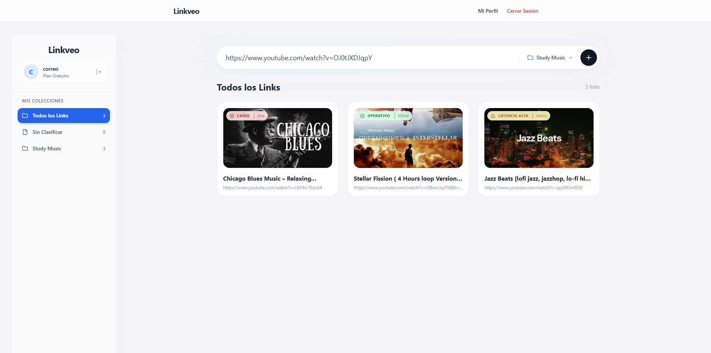

#  Linkveo - Full Stack Resource Monitor

> Plataforma SaaS de gestión y monitoreo de recursos digitales, construida sobre una arquitectura de microservicios moderna y contenerizada.



##  Descripción del Proyecto

**Linkveo** no es un monolito tradicional. Es un sistema distribuido diseñado para la escalabilidad y el mantenimiento eficiente. El objetivo principal es permitir a los usuarios organizar recursos web y, crucialmente, **visualizar el estado de salud (health check)** de los mismos mediante una interfaz reactiva e intuitiva.

El proyecto simula la **observabilidad de sistemas**, permitiendo detectar visualmente si un recurso está `Operativo`, presenta `Latencia Alta` o está `Caído`, similar a los paneles de control industrial o de infraestructura TI.

##  Arquitectura & Stack Tecnológico

El sistema está desacoplado en servicios independientes orquestados mediante Docker:

###  Frontend (Client-Side)
La interfaz de usuario se centra en el rendimiento y la experiencia de monitoreo.
* **Core:** React + Vite (SPA de alto rendimiento).
* **UI/UX:** Tailwind CSS con diseño Glassmorphism y Lucide React para iconografía consistente.
* **Features Clave:**
  * **Sentinel Badge Component:** Sistema visual de monitoreo de latencia y estado.
  * **Consumo API:** Axios con interceptores para manejo de JWT.
  * **Gestión de Estado:** React Context API + Custom Hooks.

###  Backend (Microservicios)
Dividido por dominios para asegurar la separación de responsabilidades:
* **Auth Service:** (Python/FastAPI) Maneja exclusivamente autenticación, hashing y emisión de JWT.
* **Link Core Service:** (Python/FastAPI) Gestiona el ciclo de vida de los recursos y realiza Web Scraping para enriquecer metadatos.
* **Base de Datos:** PostgreSQL (Relacional) con SQLAlchemy ORM.

###  Infraestructura (DevOps)
* **Docker:** Contenerización individual de cada servicio y la base de datos.
* **Docker Compose:** Orquestación de la red interna, volúmenes y variables de entorno.

---

##  Instalación y Despliegue Rápido

Gracias a la contenerización, no necesitas instalar Python ni Node.js localmente. Solo necesitas **Docker Desktop**.

### 1. Clonar el repositorio
```bash
git clone [https://github.com/Sebastianidm/linkveo-fullstack.git](https://github.com/Sebastianidm/linkveo-fullstack.git)
cd linkveo-fullstack

2. Iniciar el Ecosistema
Este comando construirá las imágenes y levantará los contenedores:

Bash

docker-compose up --build
Nota: La primera ejecución puede tomar unos minutos mientras se descargan las imágenes base.

3. Acceder al Sistema
Una vez finalizado el despliegue (cuando veas Application startup complete), podrás acceder a:

Web App (Frontend): http://localhost:5173

Auth API Docs: http://localhost:8000/docs

Link API Docs: http://localhost:8001/docs

Importante: Al ser un entorno volátil en Docker, la base de datos inicia vacía. Utiliza la opción "Regístrate aquí" en el login para crear tu primer usuario.

Estructura del Repositorio


linkveo-fullstack/
├── link-service/     # Microservicio de gestión de recursos (FastAPI)
├── user-service/     # Microservicio de autenticación (FastAPI)
├── linveo-app/       # Frontend Application (React + Vite)
├── docker-compose.yml # Orquestación de servicios
└── README.md         # Documentación principal


Funcionalidad Destacada: Sentinel View
En la última actualización, se integró el componente de visualización de estado en el frontend. Esto permite a los operadores:

Identificar rápidamente enlaces con problemas de disponibilidad.

Visualizar métricas de latencia simulada en tiempo real.

Tomar decisiones basadas en códigos de color semánticos (Verde / Amarillo / Rojo).

Desarrollado por Sebastián Díaz
